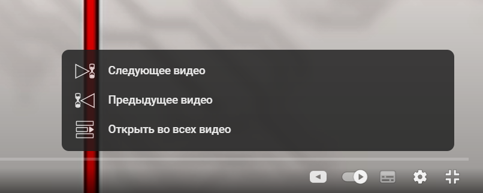

# Youtube next video extension

Данное расширение призвано решить проблему поиска соседних роликов (в хронологическом порядке) на канале.

Среди функций можно выделить:

1. Открыте следующего или предыдущего видео на канале.
2. Открытие плейлиста со всеми видео на канале с указанием в нем текущего ролика.

## Как это работает?

Расширение срабатывает на ссылках вида:

`https://www.youtube.com/watch*`

В текущей реализации в плеер встраивается кнопка, которая открывает меню с выбором доступных функций.



## Как это работает с технической точки зрения?

У данного расширения есть 3 части:

1. Скрипты клиента ([здесь](./src/client)).
2. Верхнее меню (popup) в строке расширений ([туть](./public/popup.html)).
3. Бэкэнд - часть в виде service worker ([шлеп](./src/backend)).

### Обмен сообщений - обмен данными

Расширение взаимодействует с `Youtube Data API` для поиска видео.

Чтобы не хранить `API KEY` в клиентском коде и разделить логику, используется схема с service worker.

У `chrome extension api` есть специальная обертка для комфортного обмена сообщениями между клиентским скриптом и воркером.

Таким образом, пользователь общается с клиетской частью, интегрированной в интерфейс ютуба.

Он же в свою очередь отправляет запросу service worker'у, который взаимодействует с `Youtube Data API` и возвращает ответ обратно клиентскому скрипту.

### Сборка

Для сборки используется `esbuild`, который собирает несколько байндлов:

1. `src/client/index.ts` -> `public/client.js`.
2. `src/backend/serviceWorker.ts` -> `public/sw.js`.

Для первой сборки можно использовать команду:

```sh
npm i && npm run build
```

## Установка

Для локальной установки необходимо использовать следующую схему:

1. Склонировать и собрать проект (`npm i && npm run build`).
2. Зайти на вкладку с расширениями chrome [chrome://extensions](chrome://extensions).
3. Активировать режим разработчика с помощью свича вверху.
4. Выбрать упаковку расширения.
5. Указать в качестве корневой папки `/path/to/youtube-next-video-extension/public`.
6. В результате получится `public.crx` файл.
7. Перейти во вкладку "Расширения" и переместить туда `public.crx` файл.

P.s. Тестировалось на Yandex Browser, возможно в хроме будет сложнее установить расширение не из магазина.

## ToDo лист

- [x] Научиться оптимизированно получать следующее и предыдущее видео через YouTube API
- [x] Реализовать popup приложение
- [x] Добавить возможность открыть плейлист со всеми видео на канале
- [x] Реализовать клиентский рендеринг
- [x] Настроить стили и добавить иконки
- [x] Реализовать анимации
- [ ] Добавить возможность открытия плейлиста с видеороликами в обратном порядке
- [ ] Добавить локали
- [ ] Уйти от `API_KEY` зависимости в пользу запросов от имени пользователя или добавить поле для ввода пользовательского `API_KEY` в popup

Эксперимерты:
- [ ] Внедрить реакт для клиентского рендеринга
